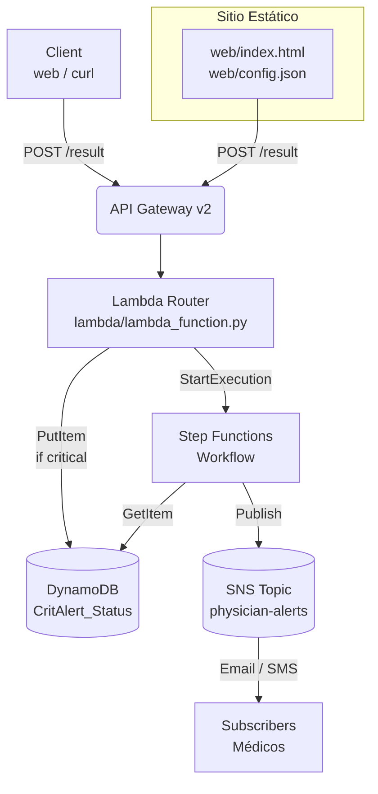

# CritAlert - ProyectoCritico

> Proyecto de referencia para detección y notificación de resultados críticos de laboratorio.

## Resumen rápido

**CritAlert** es un sistema serverless en AWS diseñado para detectar, alertar y gestionar resultados de laboratorio críticos en entornos clínicos. El proyecto demostrativo implementa un flujo end-to-end que va desde la recepción de un resultado de laboratorio hasta la notificación automática a médicos y escalamiento a especialistas si no se confirma la recepción a tiempo.

### ¿Qué problema resuelve?

En laboratorios clínicos y hospitales, los resultados críticos (ej: potasio muy alto/bajo, glucosa crítica) requieren notificación inmediata al médico responsable. El tiempo de respuesta es crucial. **CritAlert** automatiza este proceso:

1. **Detección**: Recibe resultados vía API HTTP y aplica reglas para identificar si son críticos.
2. **Persistencia**: Almacena el estado del resultado en DynamoDB para auditoría y seguimiento.
3. **Notificación**: Publica alertas a médicos vía email y SMS usando SNS.
4. **Escalamiento**: Si el médico principal no confirma dentro de 60 segundos, notifica automáticamente al médico backup.
5. **Auditoría**: Mantiene historial de cada alerta y su estado (pendiente, confirmada, escalada).

### Características principales

- **API HTTP serverless**: Construida con API Gateway v2 y Lambda; sin servidores que gestionar.
- **Lógica flexible de criticidad**: Reglas configurables para identificar resultados críticos (ej: potasio fuera de rango 3.5–5.0 mmol/L).
- **Orquestación de flujos**: Step Functions coordina notificaciones, esperas y escalamientos.
- **Notificaciones multicanal**: Email y SMS a médicos principales y backup.
- **Frontend web**: Formulario interactivo para generar y probar eventos de laboratorio.
- **Infraestructura como código**: Terraform define todos los recursos; reproducible y versionable.
- **CI/CD integrado**: GitHub Actions para validación, planificación y despliegue automático.

### Casos de uso

- **Laboratorio hospitalario**: integración con Sistema de Información de Laboratorio (LIS) para enviar resultados críticos a CritAlert.
- **Centro de diagnóstico**: notificación inmediata a médicos referentes cuando se detectan anomalías graves.
- **Centro de urgencias**: escalamiento automático si el médico de turno no responde en tiempo.
- **Investigación clínica**: auditoría y trazabilidad completa de cada alerta crítica generada.

### Tecnología utilizada

| Componente | Tecnología |
|-----------|-----------|
| API | AWS API Gateway v2 (HTTP API) |
| Lógica | AWS Lambda (Python 3.12) |
| Base de datos | AWS DynamoDB (NoSQL) |
| Orquestación | AWS Step Functions (State Machine) |
| Notificaciones | AWS SNS (Email + SMS) |
| Frontend | HTML5 + JavaScript puro |
| Almacenamiento estático | AWS S3 |
| Infraestructura | Terraform (HCL) |
| CI/CD | GitHub Actions |

### Componentes clave

- **Componentes**: `lambda/`, `terraform/`, `web/`.
- **Propósito**: recibir resultados de laboratorio, detectar criticidad (p. ej. potasio fuera de rangos), persistir estado en DynamoDB y disparar un flujo de Step Functions que notifica vía SNS y escala si no hay acuse.

## Estructura del repositorio

```
CriticalAlert/
├── .github/                    # Configuración de GitHub Actions para CI/CD
│   └── workflows/
│       └── terraform.yml       # Pipeline de despliegue automatizado
│
├── ProyectoCritico/            # Código fuente principal
│   ├── .github/                # Configuración específica del proyecto
│   │   └── workflows/
│   │       └── terraform.yml   # Workflows de CI/CD
│   │
│   ├── lambda/                 # Código de las funciones Lambda
│   │   └── lambda_function.py  # Lógica principal de procesamiento
│   │
│   ├── terraform/              # Infraestructura como código
│   │   ├── api_gateway.tf      # Configuración de API Gateway
│   │   ├── dynamodb.tf         # Configuración de DynamoDB
│   │   ├── iam.tf              # Roles y permisos IAM
│   │   ├── lambda.tf           # Configuración de Lambda
│   │   ├── main.tf             # Configuración principal
│   │   ├── outputs.tf          # Salidas de Terraform
│   │   ├── providers.tf        # Proveedores de Terraform
│   │   ├── s3.tf               # Configuración de S3
│   │   ├── sns.tf              # Configuración de SNS
│   │   ├── step_functions.tf   # Configuración de Step Functions
│   │   ├── variables.tf        # Variables de Terraform
│   │   └── variables.tf.example # Ejemplo de variables
│   │
│   ├── web/                    # Frontend estático
│   │   ├── config.json         # Configuración del frontend
│   │   └── index.html          # Interfaz de usuario web
│   │
│   ├── .gitignore             # Archivos ignorados por Git
│   ├── ARCHITECTURE.md        # Documentación de la arquitectura
│   ├── README.md              # Este archivo
│   └── deploy.ps1             # Script de despliegue para Windows
└── .git/                      # Directorio de Git (oculto)
```

### Descripción de Directorios Principales

- **.github/**: Contiene la configuración de GitHub Actions para la integración y despliegue continuo.
- **ProyectoCritico/**: Directorio raíz del proyecto.
  - **lambda/**: Contiene el código fuente de las funciones Lambda que procesan los resultados de laboratorio.
  - **terraform/**: Incluye toda la configuración de infraestructura como código usando Terraform.
  - **web/**: Contiene los archivos estáticos del frontend para probar el sistema.
  - **ARCHITECTURE.md**: Documentación detallada de la arquitectura del sistema.
  - **deploy.ps1**: Script de PowerShell para facilitar el despliegue en entornos Windows.

## Requisitos

- **git** instalado.
- **terraform** (recomendado >= 1.5, provider AWS ~> 5.0).
- **aws** CLI configurado con credenciales con permisos suficientes para crear recursos (IAM, Lambda, StepFunctions, SNS, DynamoDB, S3, API Gateway).
- **python** (opcional, para servir localmente el frontend: `python -m http.server`).
- **PowerShell** (para ejecutar `deploy.ps1` en Windows).

## Diagrama (Mermaid)



## Arquitectura y componentes

- **API Gateway v2 (HTTP API)**: expone la ruta `POST /result` y enruta a la Lambda.
- **Lambda** (`lambda/lambda_function.py`): recibe el payload, valida/extrae campos, decide si el resultado es crítico (regla simple para Potassium), escribe un item con estado `PENDING` en DynamoDB y arranca la Step Function.
- **DynamoDB** (`CritAlert_Status`): tabla con `result_id` como hash key; contiene `status`, `acknowledged` (BOOL), `timestamp` y `details_summary`.
- **Step Functions**: orquesta la notificación (publica a SNS), espera un tiempo (60s en la definición actual), consulta la tabla y decide si escalar a un backup o terminar si ya fue confirmado.
- **SNS**: tema para notificaciones; tiene suscripciones de email y SMS configuradas por Terraform.
- **S3 + Sitio estático** (`web/`): pequeña interfaz para generar y enviar eventos de prueba al API.
- **Terraform** (`terraform/`): define todos los recursos, empaqueta la Lambda (zip), sube contenido web a S3 y crea la Step Function con la definición embebida.

## Terraform outputs (recomendado)

Se recomienda usar `terraform/outputs.tf` para obtener rápidamente los valores útiles tras `terraform apply`:

```hcl
output "api_endpoint" {
  description = "Public endpoint for the HTTP API"
  value       = aws_apigatewayv2_api.http_api.api_endpoint
}

output "sfn_arn" {
  description = "ARN of the Step Functions state machine"
  value       = aws_sfn_state_machine.critalert_workflow.arn
}

output "dynamodb_table_name" {
  description = "DynamoDB table name for alert status"
  value       = aws_dynamodb_table.critalert_status.name
}

output "web_bucket" {
  description = "S3 bucket used for static web hosting"
  value       = aws_s3_bucket.web_bucket.bucket
}
```

## Despliegue

### Configuración inicial (variables.tf)

1. **Copiar la plantilla de variables**:

```powershell
Set-Location -LiteralPath 'C:\Users\tenoc\OneDrive\Escritorio\Proyecto nube\ProyectoCritico\terraform'
Copy-Item -Path 'variables.tf.example' -Destination 'variables.tf'
```

2. **Editar `variables.tf`** con tus valores reales:

```hcl
variable "project_name" {
  type        = string
  default     = "MiProyecto"  # Tu nombre de proyecto
}

variable "region" {
  type        = string
  default     = "us-east-1"   # Tu región AWS
}

variable "email_subscription" {
  type        = string
  default     = "doctor@hospital.com"  # Email para recibir alertas
}

variable "sms_subscription_1" {
  type        = string
  default     = "+34600000001"  # Teléfono médico principal
}

variable "sms_subscription_2" {
  type        = string
  default     = "+34600000002"  # Teléfono médico backup
}
```

**Nota**: El archivo `variables.tf` está en `.gitignore` para proteger datos sensibles. Solo `variables.tf.example` se commitea.

### Opción 1: Con script PowerShell (recomendado en Windows)

Ejecuta el script `deploy.ps1` que empaqueta la Lambda y ejecuta Terraform:

```powershell
Set-Location -LiteralPath 'C:\Users\tenoc\OneDrive\Escritorio\Proyecto nube\ProyectoCritico'
.\deploy.ps1 -AutoApprove
```

El script hace:
- Crea `lambda_function.zip` desde `lambda/lambda_function.py`.
- Ejecuta `terraform init` y `terraform apply` en `terraform/`.

### Opción 2: Manual (sin script)

1. Ubicarse en la carpeta `terraform`:

```powershell
Set-Location -LiteralPath 'C:\Users\tenoc\OneDrive\Escritorio\Proyecto nube\ProyectoCritico\terraform'
```

2. Inicializar Terraform:

```powershell
terraform init
```

3. Revisar el plan:

```powershell
terraform plan -out plan.tfplan
```

4. Aplicar:

```powershell
terraform apply "plan.tfplan"
```

### Notas importantes sobre el despliegue

- Antes de aplicar, revise `terraform/variables.tf` para ajustar `project_name`, `region`, y los contactos (`email_subscription`, `sms_subscription_1`, `sms_subscription_2`).
- La suscripción por email necesita que el destinatario confirme el subscription email que SNS enviará.
- Terraform empaqueta automáticamente `lambda/lambda_function.py` usando `data.archive_file` (no es necesario comprimir manualmente si usa `terraform apply` directamente).
- El frontend que se sube a S3 usa un `config.json` generado por Terraform con la URL del API.

## CI/CD (GitHub Actions)

Se incluyen dos workflows:

### `ci.yml` (Integración Continua)

Se ejecuta en `push` y `pull_request` para verificar la calidad del código:

```yaml
- terraform fmt -check
- terraform init
- terraform validate
- terraform plan
```

### `deploy.yml` (Despliegue Manual)

Workflow manual (`workflow_dispatch`) que empaqueta la Lambda y ejecuta `terraform apply` usando secretos de AWS. 

**Configuración requerida en GitHub**:
- `AWS_ACCESS_KEY_ID`
- `AWS_SECRET_ACCESS_KEY`
- `AWS_REGION`

Estos deben estar en **Settings > Secrets and variables > Actions**.

Para ejecutar:
1. Ir a **Actions** en el repositorio.
2. Seleccionar **Deploy (manual)**.
3. Hacer clic en **Run workflow**.

## Pruebas

### Probar localmente el frontend

Servir `web/` con Python:

```powershell
Set-Location -LiteralPath 'C:\Users\tenoc\OneDrive\Escritorio\Proyecto nube\ProyectoCritico\web'
python -m http.server 8000
```

Luego abrir `http://localhost:8000` en un navegador.

**Nota**: Si hace llamadas locales al API, actualice `web/config.json` con la URL del API Gateway (obtenida tras `terraform apply` o desde la consola AWS).

### Probar la API (ejemplo con curl)

Después de desplegar, obtenga la URL del API Gateway y haga:

```powershell
curl -Method POST `
  -Uri "https://<API_ENDPOINT>/result" `
  -Body (@{ 
    patient_name = 'Test'
    patient_id = 'P1'
    test_name = 'Potassium'
    value = 7.0
    is_critical = $true
  } | ConvertTo-Json) `
  -ContentType 'application/json'
```

Reemplace `<API_ENDPOINT>` por el valor real obtenido tras `terraform apply` (algo como `https://abc123def.execute-api.us-east-1.amazonaws.com`).

## Puntos de configuración y extensión

- **Lógica crítica**: en `lambda/lambda_function.py` hay una comprobación explícita para `test_name == 'potassium'` con umbrales. Modifique o extienda esta lógica según otros tests/umbrales.
- **Step Function**: espera 60s y consulta DynamoDB; cambie tiempos y comportamiento en `terraform/main.tf` si lo necesita.
- **Políticas IAM**: creadas por Terraform son permisivas en algunos recursos (`states:StartExecution` con `Resource = "*"`); en producción restrinja ARNs concretos.

## Limpieza

Para destruir los recursos creados por Terraform:

```powershell
Set-Location -LiteralPath 'C:\Users\tenoc\OneDrive\Escritorio\Proyecto nube\ProyectoCritico\terraform'
terraform destroy
```

## Documentación adicional

- `ARCHITECTURE.md` — detalles de arquitectura, modelo de datos, consideraciones de seguridad y observabilidad.

## Contacto / Soporte

Si tienes dudas o quieres agregar nuevas funcionalidades, revisa `ARCHITECTURE.md` o el código directamente.
